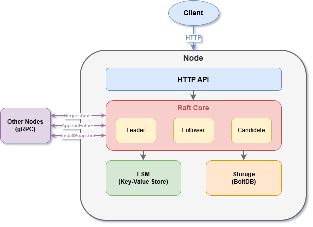

# anchor

[](https://go.dev/)
[](LICENSE)
[](https://grpc.io/)
[](https://github.com/etcd-io/bbolt)

anchor is a distributed key-value store built on the Raft consensus protocol. It provides leader election, log replication, snapshotting, and dynamic cluster membership. The implementation follows the [Raft paper](https://raft.github.io/raft.pdf) and includes a terminal UI for cluster monitoring.

## Building

If you wish to build anchor you'll need Go version 1.21+ installed.

Please check your installation with:

```
go version
```

Build the server:

```
go build -o anchor ./cmd/server
```

## Quick Start

Start a 3-node cluster:

```bash
# Terminal 1
./anchor --id node1 --port 9001 --http-port 8001 --dir ./data/node1

# Terminal 2
./anchor --id node2 --port 9002 --http-port 8002 --dir ./data/node2 --peers localhost:9001

# Terminal 3
./anchor --id node3 --port 9003 --http-port 8003 --dir ./data/node3 --peers localhost:9001,localhost:9002
```

Interact with the cluster via HTTP:

```bash
# Write a key
curl -X POST http://localhost:8001/kv/mykey -d "myvalue"

# Read a key
curl http://localhost:8001/kv/mykey
```

## Architecture



anchor is composed of several packages that work together:

- **pkg/raft** - Core Raft consensus implementation including leader election, log replication, and state machine management
- **pkg/storage** - Persistent storage using BoltDB for the log store and stable store
- **pkg/transport** - gRPC-based transport layer for inter-node communication
- **pkg/fsm** - Finite state machine implementation (key-value store)
- **pkg/tui** - Terminal UI dashboard for cluster monitoring


## Protocol

anchor is based on "Raft: In Search of an Understandable Consensus Algorithm"

A high level overview of the Raft protocol is described below, but for details please read the full [Raft paper](https://raft.github.io/raft.pdf).

### Protocol Description

Raft nodes are always in one of three states: follower, candidate or leader. All nodes initially start out as a follower. In this state, nodes can accept log entries from a leader and cast votes. If no entries are received for some time, nodes self-promote to the candidate state. In the candidate state nodes request votes from their peers. If a candidate receives a quorum of votes, then it is promoted to a leader. The leader must accept new log entries and replicate to all the other followers.

Once a cluster has a leader, it is able to accept new log entries. A client can request that a leader append a new log entry. The leader then writes the entry to durable storage and attempts to replicate to a quorum of followers. Once the log entry is considered committed, it can be applied to a finite state machine. The finite state machine is application specific - in anchor's case, it's a key-value store.

An obvious question relates to the unbounded nature of a replicated log. Raft provides a mechanism by which the current state is snapshotted, and the log is compacted. Because of the FSM abstraction, restoring the state of the FSM must result in the same state as a replay of old logs. This allows Raft to capture the FSM state at a point in time, and then remove all the logs that were used to reach that state. This is performed automatically without user intervention, and prevents unbounded disk usage as well as minimizing time spent replaying logs.

Lastly, there is the issue of updating the peer set when new servers are joining or existing servers are leaving. As long as a quorum of nodes is available, this is not an issue as Raft provides mechanisms to dynamically update the peer set. If a quorum of nodes is unavailable, then this becomes a very challenging issue. For example, suppose there are only 2 peers, A and B. The quorum size is also 2, meaning both nodes must agree to commit a log entry. If either A or B fails, it is now impossible to reach quorum. This means the cluster is unable to add, or remove a node, or commit any additional log entries. This results in unavailability. At this point, manual intervention would be required.

A Raft cluster of 3 nodes can tolerate a single node failure, while a cluster of 5 can tolerate 2 node failures. The recommended configuration is to either run 3 or 5 raft servers. This maximizes availability without greatly sacrificing performance.

In terms of performance, Raft is comparable to Paxos. Assuming stable leadership, committing a log entry requires a single round trip to half of the cluster. Thus performance is bound by disk I/O and network latency.

## Storage

anchor uses [BoltDB](https://github.com/etcd-io/bbolt) for persistent storage. Each node maintains:

- **Log Store** - Persists Raft log entries
- **Stable Store** - Persists currentTerm and votedFor
- **Snapshot Store** - Persists FSM snapshots for log compaction

Data is stored in `{data-dir}/raft.db` with snapshots in `{data-dir}/snapshots/`.

## Transport

Inter-node communication uses gRPC with the following RPCs:

- **RequestVote** - Used during leader election
- **AppendEntries** - Used for log replication and heartbeats
- **InstallSnapshot** - Used to send snapshots to lagging followers

Connection pooling is implemented to reuse connections between nodes.

## CLI Flags

| Flag | Description | Required |
|------|-------------|----------|
| `--id` | Node identifier | Yes |
| `--port` | gRPC port for Raft communication | Yes |
| `--dir` | Data directory for BoltDB storage | Yes |
| `--peers` | Comma-separated peer addresses | No |
| `--http-port` | HTTP API port (defaults to port+1000) | No |

## HTTP API

| Endpoint | Method | Description |
|----------|--------|-------------|
| `/kv/{key}` | GET | Read a key |
| `/kv/{key}` | POST | Write a key (body is value) |
| `/kv/{key}` | DELETE | Delete a key |
| `/status` | GET | Cluster status |
| `/join` | POST | Join a node to the cluster |
| `/remove` | POST | Remove a node from the cluster |

## Roadmap

This repo is a fresh start for upcoming features. Planned improvements include:

- Log compaction and truncation
- Client session handling
- Read-only queries optimization
- Metrics and observability
- Kubernetes integration

## License

MIT License - see [LICENSE](LICENSE) for details.
